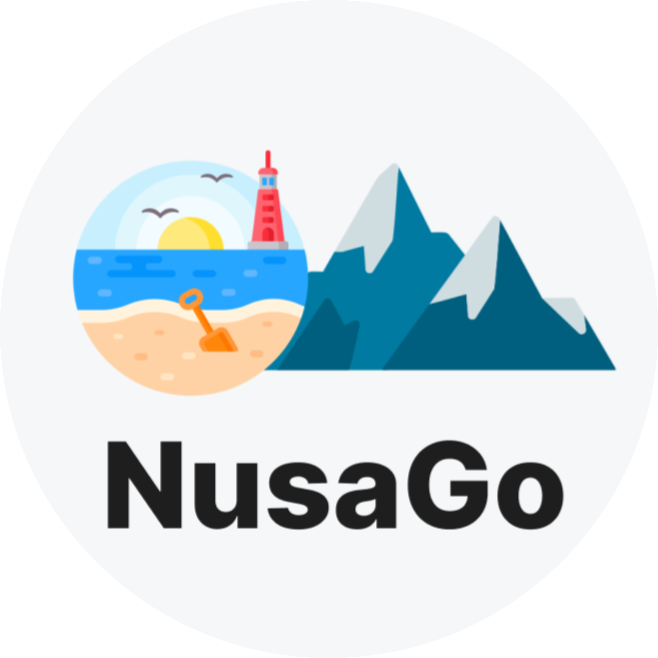

# NusaGo

### Bangkit Academy 2023 Capstone Project CH2-PS115

#### Introduction
NusaGo, a digital platform 'Your Personal Travel Guide', to help the promotion of tourist attractions as a solution in the tourism sector and contribute to the recovery and growth of the sector. NusaGo, offers personalized travel recommendations based on user's hobbies and surveys.

#### Design App
This is our **[Design App](https://www.figma.com/file/gZmx3vDvlPCnphWQqHL7o3/Untitled?type=design&node-id=0%3A1&mode=design&t=4FkYJOPbDHE2yN9W-1)**

Team Member :
* (ML) M268BSY0393 – Muhamad Alichwan – Universitas Muhammadiyah Surakarta
* (ML) M283BSX1711 – Firasyana Lathifah – Universitas Negeri Semarang
* (ML) M604BSX1141 – Endritha Pramudya – Universitas Sahid Surakarta 
* (CC) C268BSY3452 – Satria Ardiansyah – Universitas Muhammadiyah Surakarta
* (CC) C481BSX3710 – Syarla Shalsabilla Putri Rachmawati – Sekolah Tinggi Manajemen Informatika dan Komputer AMIKOM Surakarta
* (MD) A268BSY2828 – Alif Suryo Nugroho – Universitas Muhammadiyah Surakarta
* (MD) A460BSY2386 - Muhammad Rifai Sipayung - Universitas Pembangunan Panca Budi
